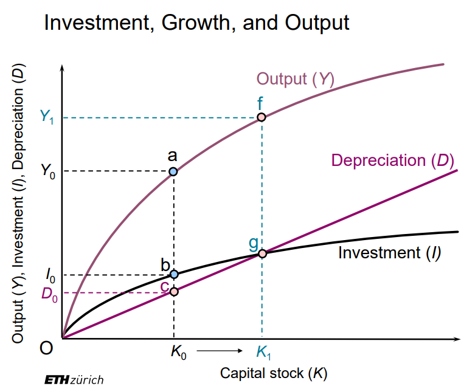
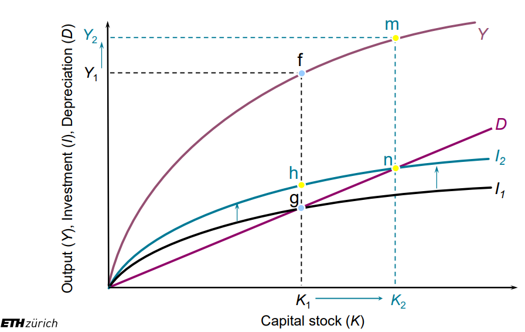
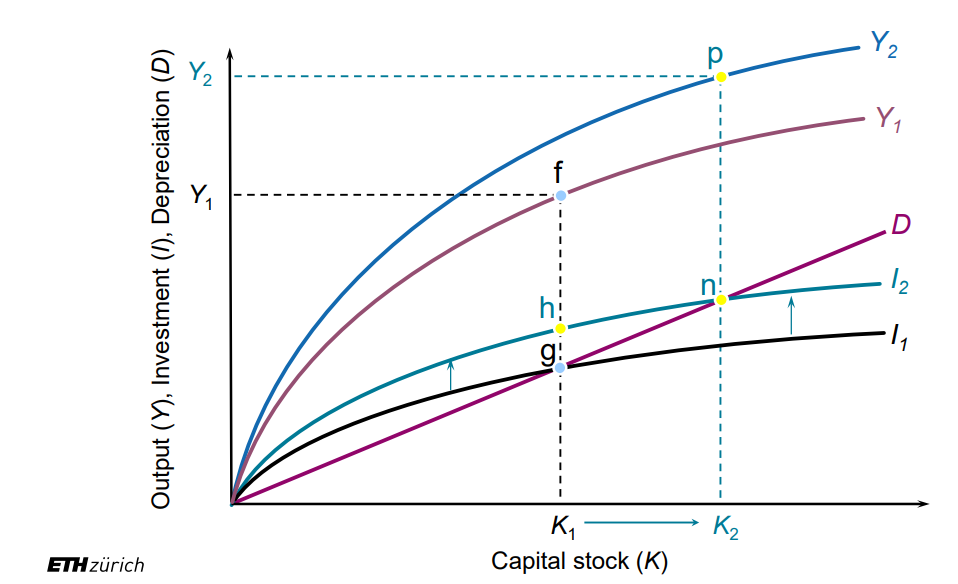
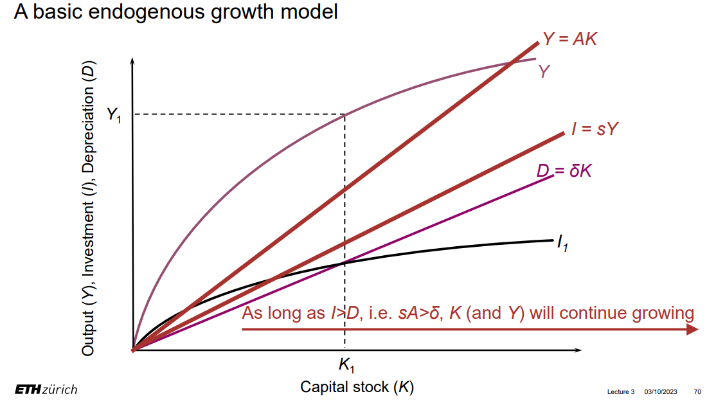

# 宏观经济学

## Introduction

* 10 principles of Economics

* economic models

    * endogenous/exogenous variable

    * ceteris paribus

* The circular-flow diagram

* The production possibilities frontier

"生产可能性边界"（Production Possibilities Frontier，PPF）是宏观经济学中的一个概念，也被称为生产可能性曲线。它是一个表示一个国家或企业在给定资源和技术条件下，能够生产的不同商品和服务组合的图形。

PPF 通常是一个凹向原点的曲线，它反映了资源的稀缺性和机会成本的概念。这个曲线上的每一点表示一种资源配置，即生产某种商品和服务的数量。在 PPF 上移动表示资源从一种用途转移到另一种用途，而沿着 PPF 曲线的内部表示资源的有效利用。

主要的概念包括：

效率点： PPF 上的点表示资源的有效利用，即在当前技术水平下，无法增加一种产品的产量而不减少另一种产品的产量。

非效率点： PPF 曲线的内部表示资源未能充分利用，存在浪费或低效率。

边际机会成本： PPF 的斜率代表了边际机会成本，即转移一个单位资源从一种产品到另一种产品时，需要放弃的产量。

扩张和收缩 PPF： PPF 的外移表示生产能力的增加，可能由于技术进步、资源增加或效率提高。相反，PPF 的内移表示生产能力的下降，可能由于资源减少或技术倒退。

总的来说，PPF 是一个重要的概念，用于理解资源配置、效率和机会成本等宏观经济学的基本原理。

* positive/normative statements

* microeconomics/macroeconomics

## National Accounting

* economy's income/expenditure

    * 总 income = 总 expenditure

    * 这是在说一个经济体内的所有收入与所有支出的值相等，因为当企业和个人支出时，这些支出成为其他人的收入，因此，总支出等于总收入，这反映了一个国家经济活动的循环和相互依赖性。不是站在国家的角度上说今年国家一分钱没赚。但人均 GPD 越高，确实 indicates 生活质量越高。

* GPD is a measure of the income and expenditures of an economy

    * 支出法计算：GDP(Y) = Consumption(C) + Investment(I) + Government Purchases 政府花的钱(G) + Net Exports(NX = X - M)

* GDP deflator = Norminal GDP / Real GDP

    * （名义）Norminal GDP: at current prices

    * Real GDP: at constant prices

    * 因为 price 是会上下浮动的，所以 Real GDP 更准，更能表示一个国家的生产能力。

* GDP 测量的缺陷

    * 钱多不是幸福的唯一标准：空闲时间、干净的环境、亲子时间等

* inflation rate 通货膨胀率，表示物价 price 上升的 rate

    * inflation/deflation

* CPI

消费者价格指数（Consumer Price Index，CPI）是一种用于测量一定篮子商品和服务价格变动的经济指标，以反映居民生活成本的变化。CPI通常被用作衡量通货膨胀水平的指标。CPI的计算基于一定的消费者支出篮子，这个篮子包含了一系列日常购买的商品和服务，如食品、住房、医疗保健、交通、教育等

比如，计算当年一篮子的价格，与零一年一篮子的价格，算出增长比值就是 inflation rate，代表同样一篮子东西因为 price 的变化产生了价格变化

* CPI 测量的缺陷

    * Substitution bias：没有充分考虑到消费者在面对价格上涨时可能会改变购买决策的情况。当某一商品的价格上涨时，消费者可能会转向更便宜或者价格相对稳定的替代品。

    * Introduction of new goods：当新的商品或服务被引入市场时，它们通常不会立即被纳入CPI的篮子中

    * Unmeasured quality changes： CPI通常难以准确进行商品和服务质量的调整。如果某种商品的质量发生变化，但价格保持不变，CPI可能无法准确反映实际通货膨胀情况。特别是在高科技产品等领域，产品的性能和质量可能在时间内发生显著变化，而CPI难以准确进行品质调整。

* CPI 计算 inflation rate v.s. GDP deflator

    * GPD deflator 计算的是 produced domestically, CPI 计算的是 consumer 买的

    * GPD deflator 计算的是一整年的所有东西，CPI 计算的是一篮子 

* producer price index，计算公司买一篮子东西的价格。

* be indexed for inflation 通货膨胀调整：如果想保持某 price 不变，通过 CPI 计算 inflation rate 来同比增长/降低 price。

* interest 利息

    * nominal interest rate：指借贷或投资中明确表示的、未经通货膨胀调整的利率。

    * real interest rate：考虑了通货膨胀对货币的影响，因此它是扣除通货膨胀后的实际利率。

## Production and growth

* production 生产: A country’s standard of living depends on its ability to produce goods and services

* Productivity 生产力：the amount of goods and services produced for each hour of a worker’s time

* GPD per capita/per worker （除以人口/工作人口）

* How Productivity Is Determined

    * physical capital 物质资本：挖油机器

    * human capital 人力资本

    * natural resources 自然资源：石油

    * technological knowledge

    * Y = A*F(L,K,H,N)

* Diminishing marginal returns（边际收益递减）是经济学中的一个原理，指的是在某个生产过程中，当一种生产要素（如劳动力或资本）的投入增加时，其他要素保持不变的情况下，其边际产出（产出改变量/生产资料改变量）逐渐减小的现象。

* The solow theory

    * saving(S) = Y-C = I

    * I = sY，按一定比例投资

    * D = δK，按一定比例衰减

    * 平衡点：I = D，这样投资的全被衰减掉了，等于没有投资，没有投资就不会产生更多的 capital 所以 capital 就不变了，达到稳定。steady state, long-run state.  

    * 增加 saving rate，就是说增加投资，I->I2

    * technological progress，增加 Y

    

* In the long run, the higher saving rate leads to a higher level of productivity and income, but not to higher growth in these areas -> catch-up effect (你不是买更多生产资料越多就能发展越快，它虽然确实在发展，但发展速度反而是刚入门的人快)

* Endogenous growth theory：只要涨就一直涨

