# 宏观经济学

## 1. Introduction

* 10 principles of Economics

* economic models

    * endogenous/exogenous variable

    * ceteris paribus

* The circular-flow diagram

* The production possibilities frontier

"生产可能性边界"（Production Possibilities Frontier，PPF）是宏观经济学中的一个概念，也被称为生产可能性曲线。它是一个表示一个国家或企业在给定资源和技术条件下，能够生产的不同商品和服务组合的图形。

PPF 通常是一个凹向原点的曲线，它反映了资源的稀缺性和机会成本的概念。这个曲线上的每一点表示一种资源配置，即生产某种商品和服务的数量。在 PPF 上移动表示资源从一种用途转移到另一种用途，而沿着 PPF 曲线的内部表示资源的有效利用。

主要的概念包括：

效率点： PPF 上的点表示资源的有效利用，即在当前技术水平下，无法增加一种产品的产量而不减少另一种产品的产量。

非效率点： PPF 曲线的内部表示资源未能充分利用，存在浪费或低效率。

边际机会成本： PPF 的斜率代表了边际机会成本，即转移一个单位资源从一种产品到另一种产品时，需要放弃的产量。

扩张和收缩 PPF： PPF 的外移表示生产能力的增加，可能由于技术进步、资源增加或效率提高。相反，PPF 的内移表示生产能力的下降，可能由于资源减少或技术倒退。

总的来说，PPF 是一个重要的概念，用于理解资源配置、效率和机会成本等宏观经济学的基本原理。

* positive/normative statements

* microeconomics/macroeconomics

## 2. National Accounting

* economy's income/expenditure

    * 总 income = 总 expenditure

    * 这是在说一个经济体内的所有收入与所有支出的值相等，因为当企业和个人支出时，这些支出成为其他人的收入，因此，总支出等于总收入，这反映了一个国家经济活动的循环和相互依赖性。不是站在国家的角度上说今年国家一分钱没赚。但人均 GPD 越高，确实 indicates 生活质量越高。

* GPD is a measure of the income and expenditures of an economy

    * 支出法计算：GDP(Y) = Consumption(C) + Investment(I) + Government Purchases 政府花的钱(G) + Net Exports(NX = X - M)

* GDP deflator = Norminal GDP / Real GDP

    * （名义）Norminal GDP: at current prices

    * Real GDP: at constant prices

    * 因为 price 是会上下浮动的，所以 Real GDP 更准，更能表示一个国家的生产能力。

* GDP 测量的缺陷

    * 钱多不是幸福的唯一标准：空闲时间、干净的环境、亲子时间等

* inflation rate 通货膨胀率，表示物价 price 上升的 rate

    * inflation/deflation

* CPI

消费者价格指数（Consumer Price Index，CPI）是一种用于测量一定篮子商品和服务价格变动的经济指标，以反映居民生活成本的变化。CPI通常被用作衡量通货膨胀水平的指标。CPI的计算基于一定的消费者支出篮子，这个篮子包含了一系列日常购买的商品和服务，如食品、住房、医疗保健、交通、教育等

比如，计算当年一篮子的价格，与零一年一篮子的价格，算出增长比值就是 inflation rate，代表同样一篮子东西因为 price 的变化产生了价格变化

* CPI 测量的缺陷

    * Substitution bias：没有充分考虑到消费者在面对价格上涨时可能会改变购买决策的情况。当某一商品的价格上涨时，消费者可能会转向更便宜或者价格相对稳定的替代品。

    * Introduction of new goods：当新的商品或服务被引入市场时，它们通常不会立即被纳入CPI的篮子中

    * Unmeasured quality changes： CPI通常难以准确进行商品和服务质量的调整。如果某种商品的质量发生变化，但价格保持不变，CPI可能无法准确反映实际通货膨胀情况。特别是在高科技产品等领域，产品的性能和质量可能在时间内发生显著变化，而CPI难以准确进行品质调整。

* CPI 计算 inflation rate v.s. GDP deflator

    * GPD deflator 计算的是 produced domestically, CPI 计算的是 consumer 买的

    * GPD deflator 计算的是一整年的所有东西，CPI 计算的是一篮子 

* producer price index，计算公司买一篮子东西的价格。

* be indexed for inflation 通货膨胀调整：如果想保持某 price 不变，通过 CPI 计算 inflation rate 来同比增长/降低 price。

* interest 利息

    * nominal interest rate：指借贷或投资中明确表示的、未经通货膨胀调整的利率。

    * real interest rate：考虑了通货膨胀对货币的影响，因此它是扣除通货膨胀后的实际利率。

## 3. Production and growth

* production 生产: A country’s standard of living depends on its ability to produce goods and services

* Productivity 生产力：the amount of goods and services produced for each hour of a worker’s time

* GPD per capita/per worker （除以人口/工作人口）

* How Productivity Is Determined

    * physical capital 物质资本：挖油机器

    * human capital 人力资本

    * natural resources 自然资源：石油

    * technological knowledge

    * Y = A*F(L,K,H,N)

* Diminishing marginal returns（边际收益递减）是经济学中的一个原理，指的是在某个生产过程中，当一种生产要素（如劳动力或资本）的投入增加时，其他要素保持不变的情况下，其边际产出（产出改变量/生产资料改变量）逐渐减小的现象。

* The solow theory

    * saving(S) = Y-C = I

    * I = sY，按一定比例投资

    * D = δK，按一定比例衰减，代表折旧（比如生产机器损耗）

    * 平衡点：I = D，这样投资的全被衰减掉了，等于没有投资，没有投资就不会产生更多的 capital 所以 capital 就不变了，达到稳定。steady state, long-run state.  

    

    * 增加 saving rate，就是说增加投资，I->I2

    

    * technological progress，增加 Y

        

* In the long run, the higher saving rate leads to a higher level of productivity and income, but not to higher growth in these areas -> catch-up effect (你不是买更多生产资料越多就能发展越快，它虽然确实在发展，但发展速度反而是刚入门的人快)

* Endogenous growth theory：只要涨就一直涨

    

## 4. unemployment and the labour market

* (long-run)natural rate of/(short-run)cyclical unemployment

* employed/unemployed/not in the labour force

* labour force participation rate = labour force / population

* unemployment rate = unemployed / labour force

* Unemployment Rate Measure 缺陷

    * 很难区分是 unemployed 还是不在 labour force 里，比如 discouraged workers

* Hysteresis refers to the effect is that the longer people are without work the less likely they are to be hired by firms

* 供需劳动数量和工资的关系

    * wage 减少，（公司）对就更想招人， 所以 demand 曲线的 labour quantity 就增加

    * wage 增加，人就更想打工，所以 supply 曲线的 labour quantity 就增加

    

* (摩擦的，表示短期浮动)Frictional unemployment

    * due to job search

* Structural unemployment

    * minimum wage laws

    

    * unions，好坏没有 consensus

    * The Theory of Efficiency Wages：付多于平衡点的钱，鼓励生产。但钱付得多了，工作岗位就少了，那些找不到工作的人也多了。

## 5. Saving, investment and the financial system

* Y – C – G = I = S

* 有税 T 之后

    * national saving: S = Y - C - G = (Y-T-C) + (T-G)

    * private savings = Y - T - C

    * public savings = T - G，国家收钱-国家开销
        
        * T>G, budget surplus

        * G>T, budget deficit 国家在亏钱

* market for loanable funds is the market in which those who want to save supply funds and those who want to borrow to invest demand funds

    * 利息越少，人就想借更多钱来花，所以 demand 曲线的 funds 就越多

    * 利息越多，人就想借别人更多钱，所以 supply 曲线的 funds 就越多

    

    * government policy

        * tax 对利息的税收增加，导致人不想存银行了（saving 减少），导致银行 loanable funds 的 supply 减少；反之对利息得到 tax 减少，loanable funds 的 supply 就会增加

        

        * investment tax credit (投资税收抵免)是一种税收政策，通常由政府提供，以鼓励企业进行投资和资本支出。该政策的目的是通过减少企业的税负来促进经济增长，激励企业增加投资，购置新设备或进行其他资本性支出。也就是说投资借的钱要支付的利息变少了，所以更多人想借钱投资了，loanable funds 的 demand 增加。

        

        * Government Budget Deficit 国家缺钱了国家也得找 bank 借钱（放证券 bank 去买），导致 bank 能提供的 loanable funds 减少，即 supply 减少。

        

## 6. The monetary system

* bartering v.s. money

* money

    * medium of exchange, unit of account, store of value

    * liquidity

    * commodity/fiat money

    * Monetary Base = Currency (M0) + Bank reserves

    * M1, M2, M3

* central bank

    * bank of the bank

    * conduct monetary policy

    * 如何控制货币

        * Reserve requirements 是商业银行必须保留的比例（一定比例的钱要交给 central bank 保管，否则要是把钱全借出去了银行很容易破产），调整这个比例就能调整货币

        * open-market operations：买证券，让自己印的钱流入市场；卖证券，从市场收钱回来

        * The discount rate 贴现率：中央银行向商业银行提供贷款，商业银行要还的利率。增加这个，money supply 减少。贴现率越大，商业银行给市场借钱越谨慎（成本越高），supply 减少。

        * The deposit rate：商业银行的钱存在中央银行，中央银行要还的利息。增加这个，money supply 减少。因为这个越大，商业银行越想往中央银行存钱，给市场的 supply 就减少。

* European Central Bank (ECB)

    * price = the Main Refinancing Rate

    * The discount rate = the Marginal Lending Rate

* Money Multiplier = 1/Reserve rate

* inflation/hyperinflation/deflation

* How Supply and Demand for Money Determine the Equilibrium Price

    * money supply 由 central bank 固定，是政治因素

    * money demand：value of money 增加，人们对 money 就不需要那么多 quantity 就可以买到同样的东西了，所以 demand 曲线 quantity of money 减少

    

* classical dichotomy

    * 实际变量（Real Variables）： 包括实际产出（实际国内生产总值，Real GDP）、实际工资、实际利率等，这些变量与实际经济活动相关。

    * 名义变量（Nominal Variables）： 包括名义产出（名义国内生产总值，Nominal GDP）、名义工资、名义利率等，这些变量是以当前价格和货币单位度量的。

    * monetary neutrality：货币不影响实际变量，它只影响名义变量。这个观点表明，在理论上，货币的数量变动不应该影响实际经济的决定性因素，如就业水平、生产水平等。

* 货币数量论（The Quantity Theory of Money）是宏观经济学中的一种理论，它关注货币供应和总体价格水平之间的关系。这一理论的基本观点可以概括为：MV=PY

    * M 代表货币供应（Money Supply）

    * V 代表货币的速度（Velocity of Money），即货币在经济中的平均流通速度。

    * P 代表物价水平（Price Level），即一般物品和服务的价格水平。

    * Y 代表实际产出（Real Output），即国民经济的实际生产水平。 

    * V 基本不会变

    * money is (in the long-run) neutral，即 M 不影响 Y。所以 M 增加，V Y 不变，P 增加。

* 通货膨胀税（The Inflation Tax）是指通货膨胀对货币持有者的实际财富产生的一种影响。虽然通常不是政府明确课征的税收，但通货膨胀的过程实际上可以被视为对货币持有者的一种隐性征税。

* 记得前面说过 nominal interest rate = real interest rate + inflation rate

    * The fisher effect 认为 (1 + nominal interest rate) = (1 + real interest rate)(1 + inflation rate)，区别不大

    * inflation rate 上升，real interest rate 应该保持不变（因为这是由 loanable fund macket 决定的），所以 nominal interest rate 上升同等数量。

* the costs of inflation

    * Shoeleather costs（鞋底成本）是指由于通货膨胀而导致人们频繁进行货币的购买和持有，从而引起的一系列成本。这个术语来自于人们为了减少货币贬值而不断走动，好像在走动中磨损了鞋底一样。这些成本主要与人们试图避免持有过多货币而频繁进行银行存取、零售购物等活动有关。比如银行取钱手续费

    * Menu costs（菜单成本）是指企业因为调整价格而产生的一系列成本，这种调整价格的过程就好像调整一份菜单一样。比如调整价格的实体店就会重新印刷和更新标签，带来成本等。

    * Relative price variability：价格变了以后 allocation of resources 和 relative price 不是最优匹配，带来 Misallocation of Resources

    * Inflation-Induced Tax Distortion 通货膨胀引起的税收扭曲是指由于通货膨胀对税收制度产生的一系列影响，导致税收体系在通货膨胀环境下对纳税人和经济产生不利影响的现象。比如导致纳税人支付超过其实际能力的税收。

    * Confusion and Inconvenience: with rising prices, it is more difficult to compare real revenues, costs, and profits over time

    * Arbitrary Redistribution of Wealth: in a way that has nothing to do with either merit or need，带来财富分布不合理

* deflation 也是坏事

    * 价格越来越低，那今天为什么要花钱呢？你不买我不买，明天还能跌两百。

    * 不投资了，不花钱了，导致经济不增长，增加失业率。

## 7. International trade

* Welfare Economics 福利经济学的目标是研究经济政策和资源配置对整个社会福利的影响，以便提出关于如何最大化社会福利的建议。

    * consumer surplus 是 buyer's side 的福利，price level 与 demand 曲线围成的图形

    * producer surplus 是 seller's side 的福利，price level 与 supply 曲线围成的图形

    * total surplus = consumer surplus + producer surplus

    * Pareto efficient 一种资源配置被认为是帕累托有效的，如果没有任何人能够在不损害其他人的情况下变得更好。换句话说分配到极限了。

    

* Free market

    * allocate the supply of goods to the buyers who value them most highly, as measured by their willingness to pay

    * allocate the demand for goods to the sellers who can produce them at least cost

    * produce the quantity of goods that maximizes the sum of consumer and producer surplus

    * trade 可以使得双方利益都变大，即使有一方完全不如另一方（各方面都有 Absolute Advantage，不一定代表有 Comparative Advantage）

* international trade

    * 当 world price > 国内稳定点 price，代表这个东西国内便宜，国外就想从国内买，所以产生 export，这样 total surplus 会增加 D，是好事。（consumer 小亏 producer 赚麻了）

    

    

    * 当 world price < 国内稳定点 price，代表这个东西国外便宜，国内就想从国外买，所以产生 import，这样 total surplus 会增加 D，也是好事。（consumer 赚麻了 producer 小亏）

    

    

    * 国际贸易不光进出口都能增加 total surplus，它还有这些好处

        * Increased variety of goods

        * Lower costs through economies of scale

        * Increased competition

        * Enhanced flow of ideas

    * 但还是要限制国际贸易，原因在于，比如对于某些商品 producer 会小亏但一直亏他也顶不住。所以可以看到后续 Restrictions 虽然会让 total surplus 变少，但还是得限制。

* Restrictions on Trade

    * Tariff 关税：国内 import 的商品会收更高的税，这样外国人自然要提高这个商品的价格。这样会带来 deadweight loss D 和 F，total surplus 变少了，是坏事。（E 是 tariff 带来的政府收入）

    

    

    * import quota：国内 import 的商品会有一定的限额（防止无限制 import）。有了限额之后，supply 分为两部分：国内的 supply 和 import 的 supply。当国内价格小于 world price 时没有 import supply，因为外国人觉得出口到其他地方更赚钱。当国内价格等于 world prive 时开始 import，这个 import supply 被 quota 限制。这样会带来 deadweight loss D 和 F，total surplus 变少了，是坏事。（deadloss 应该是 E''+F..?）

    

    

    * domestic producer subsidy：给 producer 钱鼓励生产，所以 supply 增加。这对于 producer 来说，就相当于东西的价格上升了 per unit subsidy 这么多，所以新的 producer surplus 为 G+(E-F)，这样会带来 deadloss F。（E 是政府 subsidy 带来的开销，为啥？）

     

    
    
## 8. Open-economy macroeconomics

* open/closed economy

* NX = 0 is called trade balance

* 净资本外流（Net Capital Outflow，NCO）是指一个国家在一定时期内对外资产和外负债的净流动。它反映了一个国家在全球经济中资本的流动方向，包括私人和政府部门的资本。简单来说就是国内向国外投资 - 国外向国内投资。

    * NCO > 0 时，表示资本净流出，即国内资金投资于国外资产（国内收到的国外资产 > 国外收到的国内资产）

    * S - I = NCO，因为国家储蓄除了国内投资就是国外投资。

    * 而 S-I=NX，所以 NX = NCO（NX>0 时净出口大于 0，国内收到的国外资产 > 国外收到的国内资产）

* 国际收支（Balance of Payments，BoP）是一个记录一个国家与其他国家之间所有经济交易的会计表。它提供了一个国家在特定时期内与外部世界的经济往来的全面概述，包括贸易、资本流动、服务、转移支付等。

    * 经常账户（Current Account）：经常账户记录的是一个国家与其他国家之间的商品和服务交易。简单来说就是买卖东西记账。一般记 NX （NX 就是日用品等东西买卖）

    * 资本账户（Financial/Capital Account）：资本账户记录的是一个国家与其他国家之间的资本流动。简单来说就是买卖钱（债卷等）记账。一般记 NCO（NCO 就是国家间互相投资）

    * 比如 A Swiss firm buys a machine for CHF 1000 from a Danish firm，那么 Swiss current account 会记 NX=-1000CHF，financial account 会记 NCO=-1000CHF。

* exchange rate 汇率

    * appreciation 增值/depreciation 贬值

    * nominal exchange rate（比如谷歌汇率 CHF:CNY = 8:1）

    * real exchange rate 比的是购买力（比如一碗面在中国卖 5 CNY，在瑞士卖 20 CHF，那 CHF:CNY = 20*8:5 = 32:1!!）

    * 汇率决定第一理论：purchasing-power parity (PPP) theory：a good must sell for the same price in all locations，也就是说 real exchange rate 应该为 1。但显然有缺陷：

        * Many goods are not easily traded or shipped from one country to another

        * Tradable goods are not always perfect substitutes when they are produced in different countries

* 回顾之前的 「The Market for Loanable Funds 图」，我们可以通过 「NCO 与 real interest rate 的图」得到 「The Market for Foreign-Currency Exchange 图」。

    * 对于 「The Market for Loanable Funds 图」 的平衡点利率 r1，我们在 「NCO 与 real interest rate 的图」 里找到 NCO，这个 NCO 就是 「The Market for Foreign-Currency Exchange 图」 的 Supply。

    

    * 「NCO 与 real interest rate 的图」 如下。国内利率越高，就越吸引国外的人投资国内（NCO越小），就越吸引国内的人投资国内而不是国外（NCO越小）

    

    * 「The Market for Foreign-Currency Exchange 图」 如下。这个图也说明 NCO/supply 跟汇率没关系，它只跟国内利率有关。

    

* How policies and events affect an Open economy

    * Government budget deficits，前面分析过如果政府缺钱了，国内 loanable funds supply 会减少。

    

    * import quota，只影响 demand（为啥）

    

    * capital flight（资本外逃）指的是大量的金融资本从一个国家撤离，转移到其他国家寻求更安全或更有利可图的投资机会。国内 loanable funds 需求增加

    

## 9. Business cycles

* economic fluctuations

    * 没规律难预测

    * 但 fluctuation 总有点大致规律，叫 business cycle

* Okun's law 的核心观点是，失业率和实际GDP之间存在一种稳定的负相关关系。具体而言，奥肯发现，当实际GDP增长时，失业率下降，反之亦然。

* Unemployment is a lagged indicator 当你观察到失业率上升时，经济基本已经寄了一段时间了

* recession 倒退，depression 萧条，大倒退

* business cycle

    * Classical cycle: Looking at the level of GDP

        * contradiction 收缩：GPD 减少

        * expansion 扩张：GPD 增加

    * Growth cycle: Looking at the deviation of GDP from potential (/trend)

    * Growth rate cycle: Looking at the growth of GDP

    * Boom（繁荣），Bust（衰退），Upswing（上升），Downturn（下降）

* stationary（平均数稳定）/nonstationary （平均数不稳定）data

* comovement

    * Procyclical：跟 GDP 是一个 trend 的变量。above trend when GDP is above trend, real wages for example.
    
    * Countercyclical：unemployment for example.

* coincident/leading/lagging indicator

* Causes of Changes in the Business Cycle

    * Household spending decisions

    * Firms’ decision making

    * External sources

    * Government policy

    * Confidence and expectations

* Business cycle models

    * supply-side

    * demand-side

    * classical models: if markets are assumed to clear

    * Keynesian models: if markets are not assumed to clear 

    * supply-side & classical model: Labour markets clear but workers have imperfect information

        * 工人预测到价格上升，意识到 real wage 会下降（因为 nominal wage 不变），如果他选择 supply less labour -> demand for labour > supply of labour -> nominal wage 上升，好，恢复平衡。 

        * 工人如果意识不到价格上升，他选择保持相同 labour supply -> demand for labour (公司觉得劳动力变廉价了，便要求更多劳动力)> supply of labour -> norminal wage 上升，但还是没 price 上升得多，最终 output 会上升但 real wage 还是没有回到当初。所以 price 上升，real wage 下降（real wage 是 price 的 countercyclical）

    * supply-side & Keynesian models:

        * Keynes believed markets do not clear quickly，粘性（僵化）工资、价格

        * 价格上升 -> real wages 降低 -> 公司要求更多劳动力，工人 labour supply 保持不变（real wage 是 price 的 countercyclical）

    * demand-side & classical model: 

        * "Inflation fallacy"（通货膨胀谬误）

            * Firms might not be able to distinguish between inflation and a relative price change

            * An observed increase in the price of the goods firms supply might lead them to produce more

            * Workers misinterpret a rise in nominal wages as a rise in real wages

        * TODO 这也不是 demand-side 啊。。？

    * demand-side & Keynesian models:

        * TODO

    * Real Business Cycle models

        * 考虑 positive and negative technology shocks

        * 政府、中央银行不用干预，employment, labour productivity and real wages are procyclical TODO

## 10. Keynesian Economics and IS-LM Analysis

* planned/actual speding, saving or investment

* Full employment is when those people who want to work at the going rate are able to find a job 不等于失业率为 0，因为还有些不想工作的也属于 labour force

* 基本概念

    * Full employment output 满就业产出是指一个经济体在充分利用所有生产要素（劳动力、资本等）的情况下能够实现的产出水平。在这个状态下，失业率最低，生产要素得到了充分利用。它表示在不引起通货膨胀的情况下，经济体能够实现的最高产出水平。

    * 国民收入（National Income）是一个国家在一定时期内（通常是一年）内所有居民和企业创造的总收入。它包括工资、利润、利息和租金等各种形式的收入，这里就是指 GDP（收入侧计算出来的）。可以认为是 planned expenditure，也就是说这是计划的支出。

    * 总支出（Total Expenditure）是在一定时期内，社会中所有最终产品和服务的购买总额，等于当前 C+G+I+NX，也是 GDP（花费侧计算出来的）。可以认为是 actual expenditure

    * 在满就业产出水平，总支出等于国民收入。可以认为钱都花完了，这是最好的（不是说想当然的总支出越少，剩的钱越多越好，因为比如剩的钱都可以拿去投资，钱是有时间概念的，这个钱放在这什么都不做反而不是好事）

    * output 产出，值与国民收入相等，所以就是 National Income，记为 Y。

    * 支出就是需求，国民收入决定于总支出或者说总需求的水平

* Keynesian cross

    * 认为市场 planned == actual 时才是最好的，即市场出清（market clearing），national income == total expenditure，也就是当前是 full employment output

    * E = C + I + G + (X-M)， （Total Expenditure）actual expenditure 是一个关于 （National Income）planned expenditure 的函数，计划开销越高，实际开销越高，所以斜率是正数。

    * 通货紧缩缺口（Deflationary Gap）指的是实际国内生产总值（Real GDP）低于潜在国内生产总值（Potential GDP）的情况。潜在国内生产总值是在充分就业和资源充分利用的情况下，一个经济体能够实现的最高产出水平

    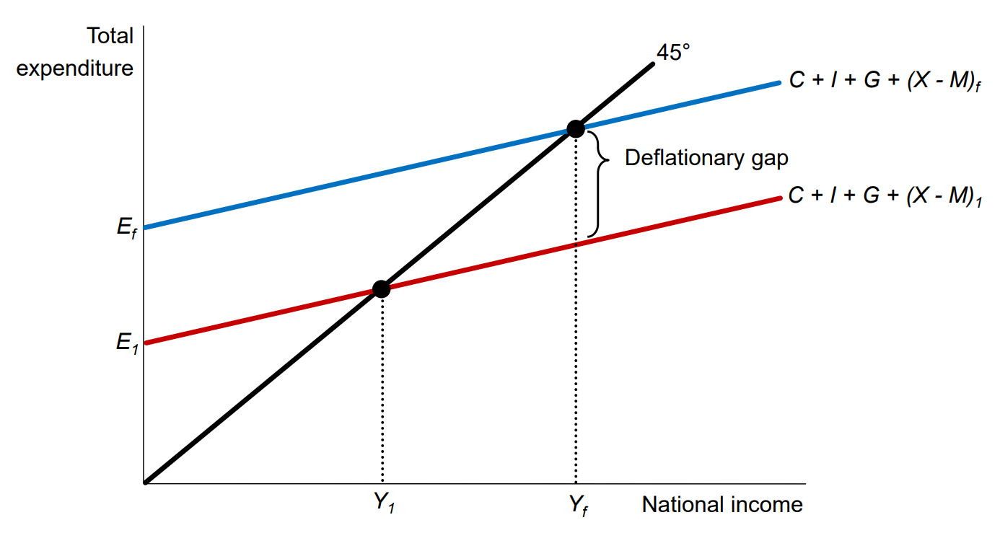

    * 通货膨胀缺口指的是实际国内生产总值（Real GDP）高于潜在国内生产总值（Potential GDP）的情况。潜在国内生产总值是在充分就业和资源充分利用的情况下，一个经济体能够实现的最高产出水平。这也不是好事，可能导致通货膨胀加剧、资源过度使用、产能紧张等问题。

    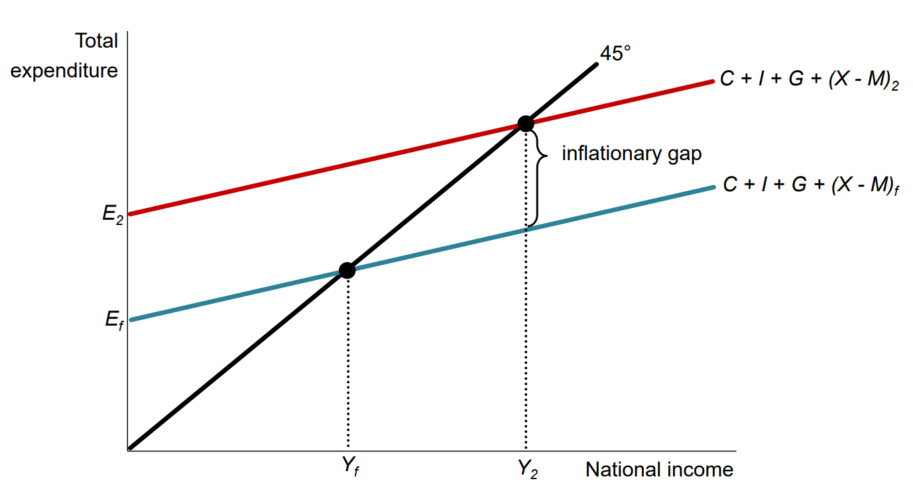

    * 自主支出（Autonomous Expenditure）指的是在国内生产总值（Gross Domestic Product，GDP）中不受个人或企业的收入水平变化影响的支出部分（就是上图与 Y 轴的交点）； induced expenditure 相反，指的是受收入水平影响的部分

* The accelerator principle（加速原理）是宏观经济学中的一个概念，描述了投资与国内生产总值（GDP）变化之间的关系。该原理认为，对于产出的小幅变化，投资的变化可能会更显著。具体而言，当国内生产总值（GDP）增长或下降时，对投资的影响会按照一个加速的比例进行变化。Multiplier effect（乘数效应）

* 边际消费倾向（Marginal Propensity to Consume，MPC）：如果一个家庭额外获得了100美元的收入，并决定将其中的80美元用于购买商品和服务，那么边际消费倾向就是 0.8，边际储蓄倾向 MPS 是 0.2

    * the Spending Multiplier 支出乘数衡量了支出变化对整体经济的影响有多大。较高的乘数表示更大的影响。1/MPS 或 1/(1-MPC)，MPS 越小代表人们越愿意消费，支出乘数就越大

* national income（即 output）ΔY = 1/MPW * ΔE

    * MPW = MPT + MPM + MPS，1/MPW 是乘数

    * MPT: the marginal propensity to taxation

    * MPM（MPI）: the marginal propensity to import

    * MPS: the marginal propensity to save

    * 反映的是增大开销之后再次达到平衡点，国民收入会相应增大的程度。

    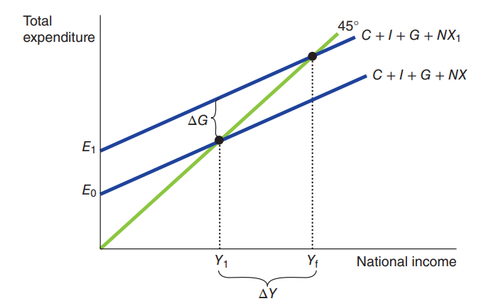

* IS&LM curve

    * IS 曲线刻画了 goods market 商品市场的平衡点，从keynesian-cross 图或 loanable-market 图得到（loanable-market 的平衡点就是商品市场的平衡点）

    * LM 曲线刻画了 money market 货币市场的平衡点，从 money market 图得到（money market 的平衡点就是货币市场的平衡点）

    * 这两个市场由 利率 联系在一起

* Liquidity trap

    * LM 曲线前半段变成水平

## 11. Aggregate demand and aggregate supply

* Aggregate Demand 曲线

    * 曲线斜率是负的的解释

        * The Wealth Effect

        * The Interest Rate Effect

        * The Exchange-Rate Effect

    * 曲线受什么影响

        * (autonomous) Consumption

        * (autonomous) Investment

        * Government Purchases

        * (autonomous) Net Exports

        * Money Supply

* Aggregate Supply 曲线

    * long run AS/short run AS

    * 曲线斜率是正的的解释

        * The Sticky-Wage Theory

        * The Sticky-Price Theory

        * The Misperceptions Theory

    * 曲线受什么影响

        * Labour (e.g. net immigration)

        * Capital

        * Natural Resources

        * Technological Knowledge （i.e. inventions of new technology）

* long-run 平衡：natural rate of output

## 12. Monetary and Fiscal Policy

* Monetary 货币政策 and Fiscal 财经政策 policy 用来稳固经济，中和 aggrate demand 改变带来的影响

* Monetary policy

    * Central bank 通过货币政策移动 aggregate demand curve

    * CB（通过印钱并以证券形式借出去使其流入市场等）提高 money supply，利率就会减少，goods and services 需求量就会增加，所以 aggregate demand 就会右移。

    * CB （通过购买企业、银行证券等方式获得现金）减少 money supply，利率就会增加，goods and services 需求量就会减少，aggregate demand 就会左移。

    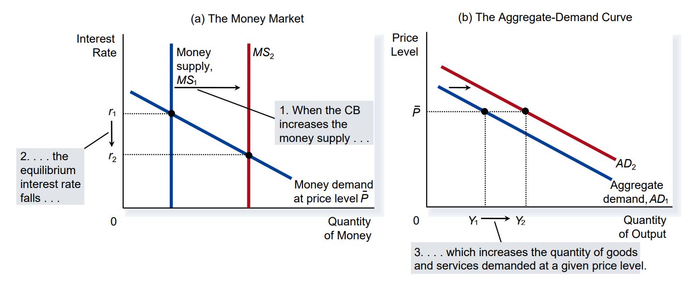

* Fiscal policy

    * 提高政府开销或减少 tax，demand 增加，aggregate demand 右移

    * 减少政府开销或增加 tax，demand 减少，aggregate demand 左移

    * fiscal change 程度 -> aggregate demand shift 程度

        * The multiplier effect tends to amplify

        * The crowding-out effect tends to dampen

## 13. Philips Curve / Supply-side policies

* THE PHILLIPS CURVE

    * 菲利普斯曲线表达了短期内通货膨胀和失业之间的负相关关系，即在经济中，通常存在一个权衡点，选择较低的失业率可能伴随较高的通货膨胀率，反之亦然。

        * 决策者提高 AD 来减少失业率，但会导致 inflation

        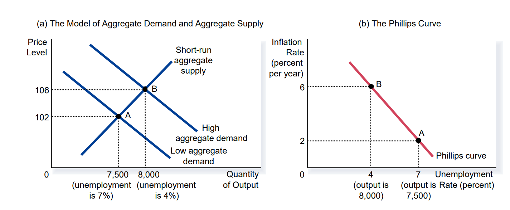

        * 决策者降低 AD 来减少 inflation，但会导致失业率上升

    * The Long-Run Phillips Curve

    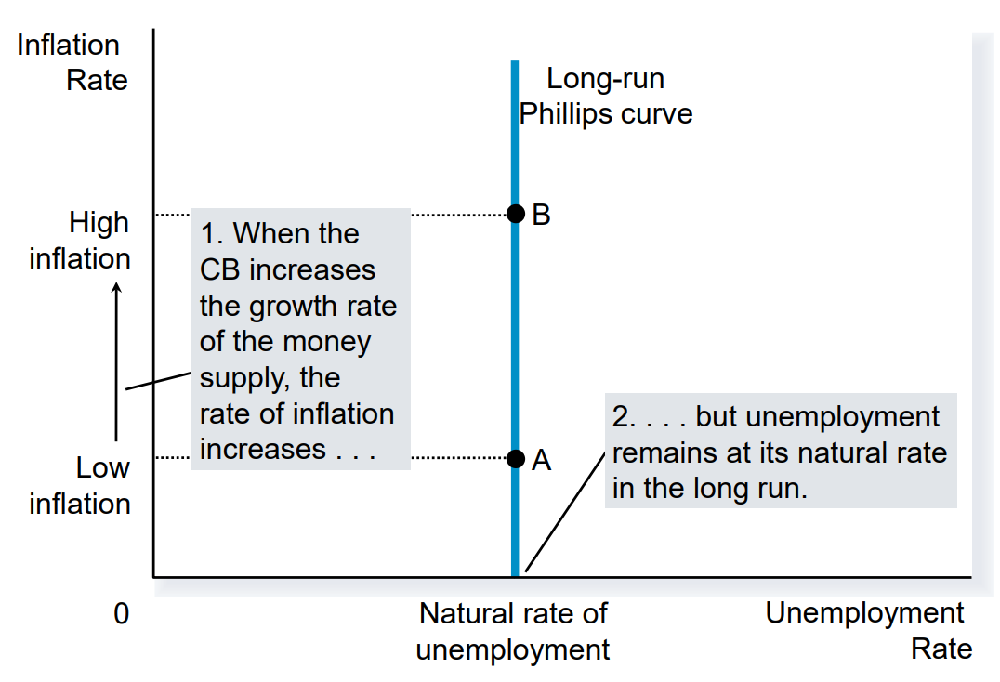

TODO

## Notes

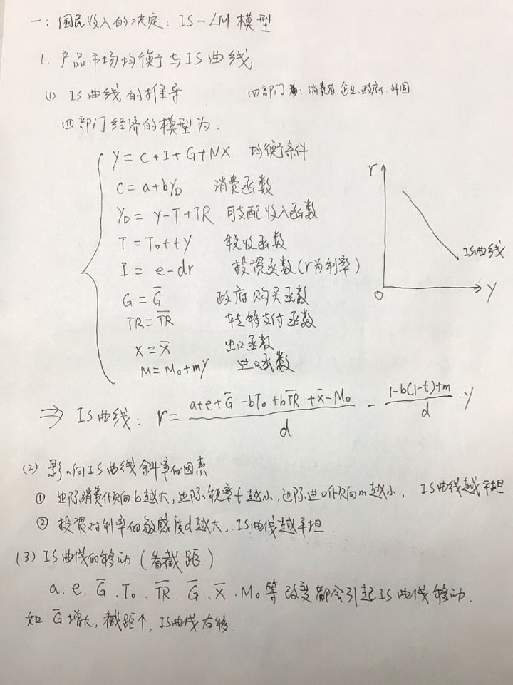

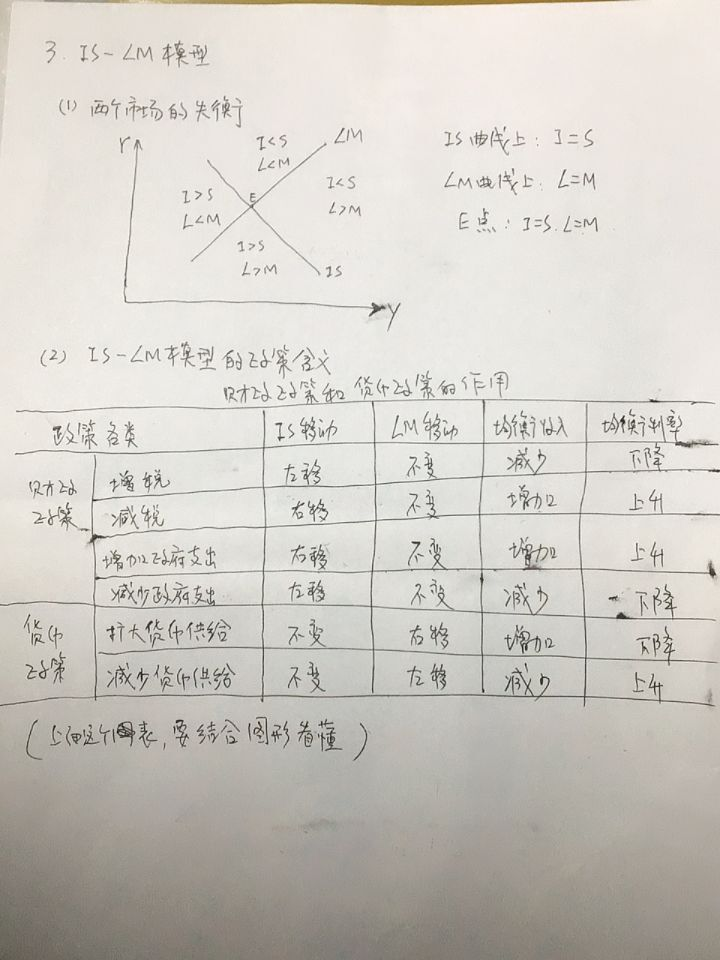

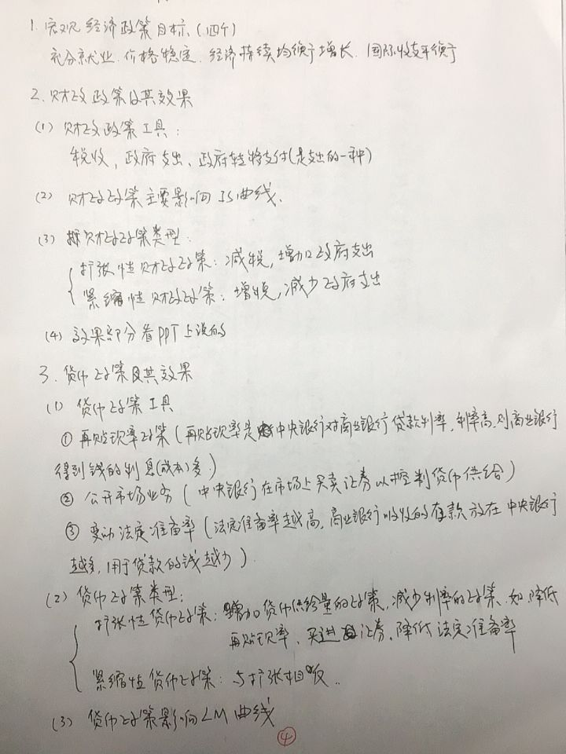

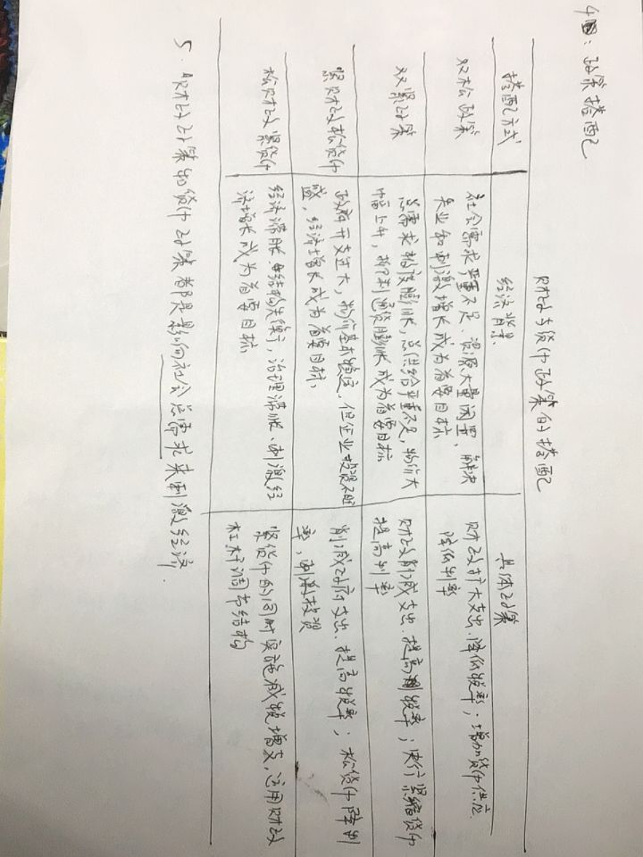

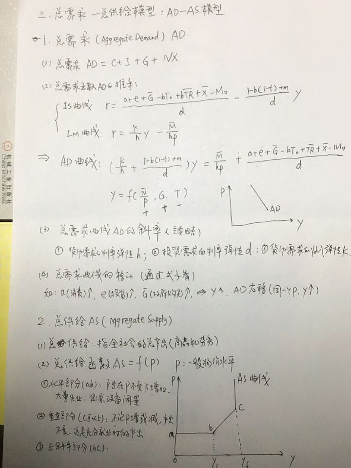

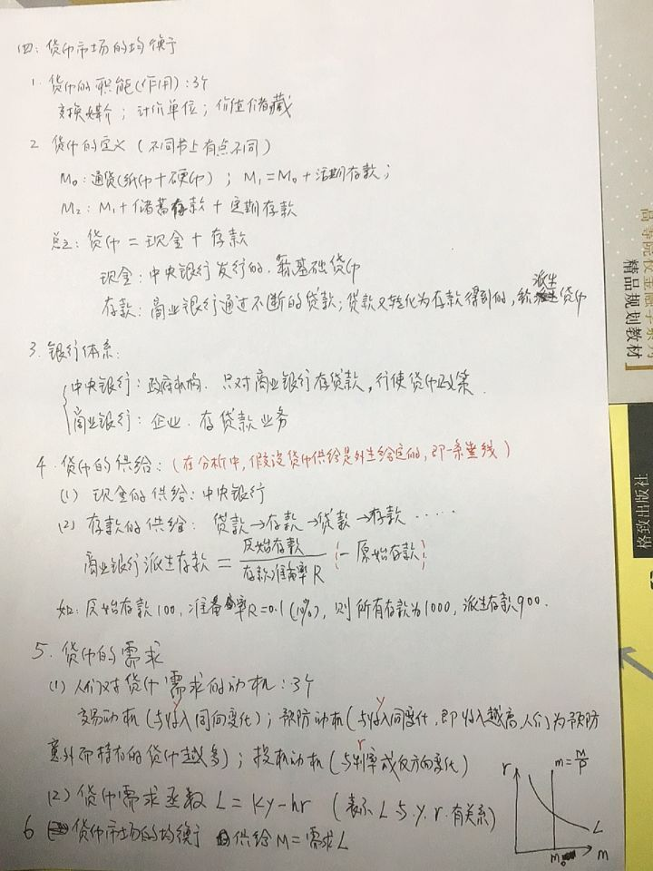

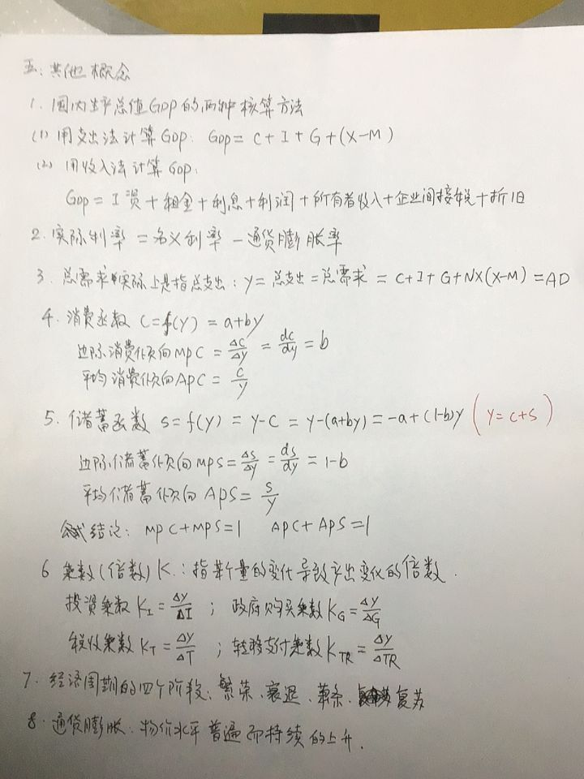
